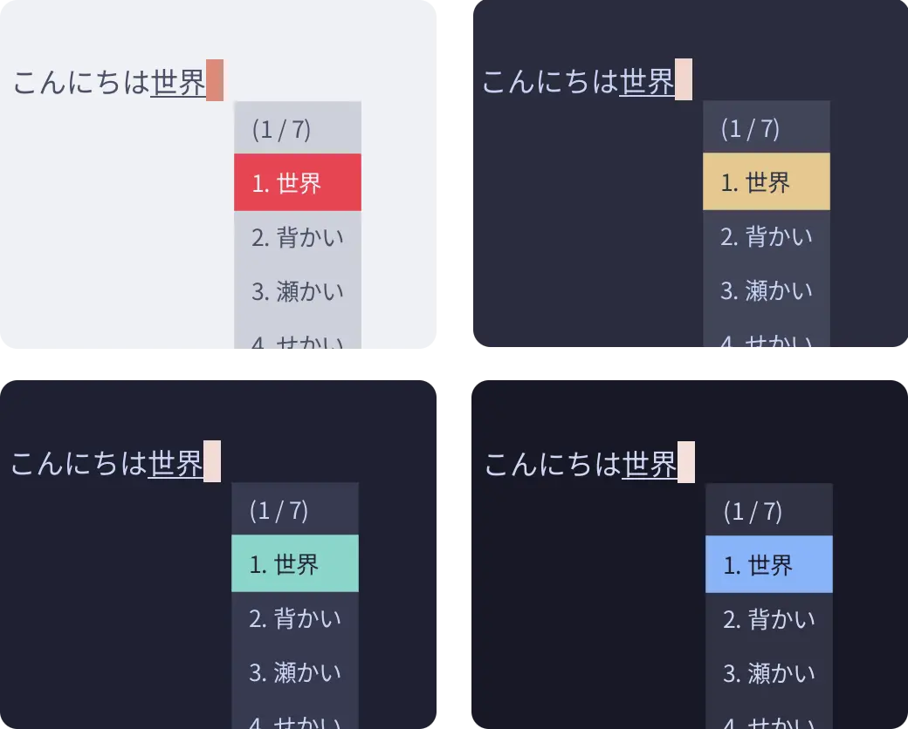
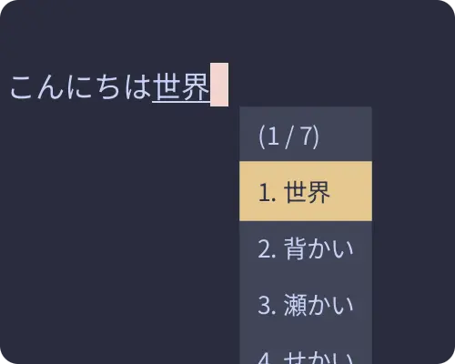

<h3 align="center">
	<br/>
	
	Catppuccin for <a href="https://fcitx-im.org">Fcitx5</a>
	
</h3>

<p align="center">
    <a href="https://github.com/catppuccin/fcitx5/stargazers"></a>
    <a href="https://github.com/catppuccin/fcitx5/issues"></a>
    <a href="https://github.com/catppuccin/fcitx5/contributors"></a>
</p>

<p align="center">
  
</p>

## Previews

<details>
<summary>🌻 Latte</summary>

</details>
<details>
<summary>🪴 Frappé</summary>

</details>
<details>
<summary>🌺 Macchiato</summary>

</details>
<details>
<summary>🌿 Mocha</summary>

</details>

## Usage

### Installation

```sh
git clone https://github.com/catppuccin/fcitx5.git
mkdir -p ~/.local/share/fcitx5/themes/
cp -r ./fcitx5/src/* ~/.local/share/fcitx5/themes
```

### Enabling (Manually)

In `~/.config/fcitx5/conf/classicui.conf`, change the `Theme` variable to the following format:

```dosini
Theme=catppuccin-{flavour}-{accent}
```

**Flavour** can be one of the following: *latte*, *frappe*, *macchiato* or *mocha*

**Accent** can be one of the following: *rosewater*, *flamingo*, *pink*, *mauve*, *red*, *maroon*, *peach*, *yellow*, *green*, *teal*, *sky*, *sapphire*, *blue* or *lavender*

e.g.
```dosini
Theme=catppuccin-mocha-mauve
```

Later restart Fcitx5 to apply the theme.

```sh
fcitx5 -r
```

### Enabling (GUI)

1. Navigate to `Fcitx5 Configuration` application through your application launcher.
2. Select the `Addons` Tab.
3. Select the setting icon (gear-wheel) for `Classical User Interface`, located to the right.
4. Apply Catppuccin as the desired fcitx5 theme by navigating to `Theme` and later selecting Catppuccin *Flavour* *Accent*.

## 💝 Thanks to

- [ayamir](https://github.com/ayamir)
- [Isabelincorp](https://github.com/isabelincorp)
- [justTOBBI](https://github.com/justTOBBI)
- [Kurome](https://github.com/kuromedayo)

&nbsp;

<p align="center"></p>
<p align="center">Copyright &copy; 2021-present <a href="https://github.com/catppuccin" target="_blank">Catppuccin Org</a>
<p align="center"><a href="https://github.com/catppuccin/catppuccin/blob/main/LICENSE"></a></p>
